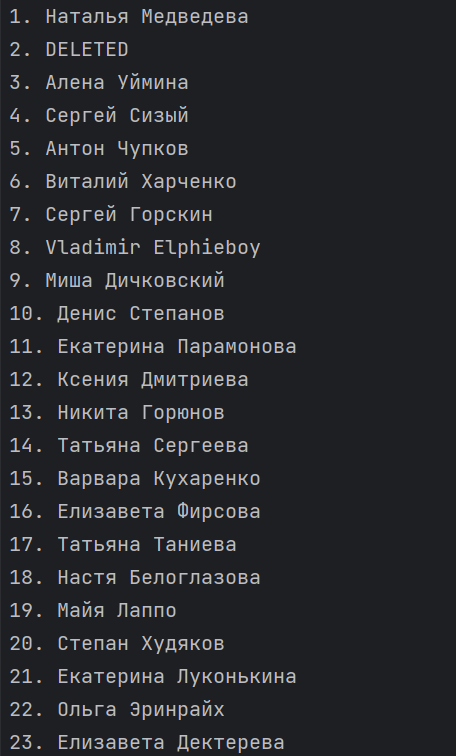

# Использование VK API
Короткова Мария КН-201

Постановка задачи:
>Требуется, используя, API ВКонтакте получить информацию и вывести ее в удобочитаемом виде. Например, вывести
список друзей указанного пользователя.

Запуск программы:
>py main.py 

Далее нужно будет ввести дынные(access token и ID пользователя)
>Enter VK API access token:
>
>Enter VK user ID: 

Результат работы программы:

